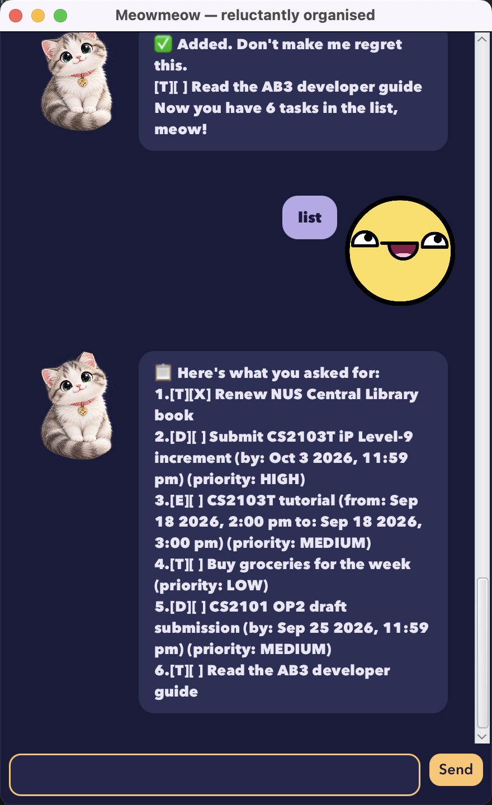

# Meowmeow User Guide



Meowmeow is a desktop app for tracking your tasks - todos, deadlines, and
events - through a chat-style window. It's built for typing: if you can
type fast, Meowmeow can manage your tasks faster than any point-and-click
task app. It also has opinions about your to-do list, whether you asked
for them or not.

## Quick start

1. Ensure you have Java 25 installed on your computer.
2. Download the latest `meowmeow.jar`.
3. Run it with `java -jar meowmeow.jar`, or double-click it.
4. Type a command into the box at the bottom of the window and press Enter
   (or click Send).

## Features

### Adding a todo: `todo`

Adds a task with no date attached.

Example: `todo borrow book`

```
 Fine. Added. Happy now?
   [T][ ] borrow book
 Now you have 1 task in the list, meow!
```

### Adding a deadline: `deadline`

Adds a task due by a specific date/time.

Format: `deadline <description> /by <when>`

Example: `deadline return book /by 2/12/2019 1800`

Accepted date formats: `2/12/2019 1800`, `2/12/2019`, `2019-12-02 1800`, or
`2019-12-02`.

```
 There. Added. You're welcome.
   [D][ ] return book (by: Dec 2 2019, 6:00 pm)
 Now you have 1 task in the list, meow!
```

### Adding an event: `event`

Adds a task spanning a start and an end.

Format: `event <description> /from <start> /to <end>`

Example: `event project meeting /from 2/12/2019 1400 /to 2/12/2019 1600`

The end must not be before the start.

### Listing all tasks: `list`

Shows every task, numbered from 1.

Example: `list`

### Listing tasks on a date: `list <date>`

Shows only the deadlines due, and events spanning, the given date.

Example: `list 2/12/2019`

### Finding tasks: `find`

Shows the tasks whose description contains a keyword. The search is
case-insensitive and matches anywhere in the description.

Example: `find book`

### Marking a task as done: `mark`

Format: `mark <task number>`

Example: `mark 1`

### Marking a task as not done: `unmark`

Format: `unmark <task number>`

Example: `unmark 1`

### Deleting a task: `delete`

Removes a task from the list permanently.

Format: `delete <task number>`

Example: `delete 1`

### Exiting: `bye`

Says goodbye and closes the window.

## Saving the data

Meowmeow saves your tasks to `./data/meowmeow.txt` automatically after
every change that adds, removes, or updates a task - there's no separate
save command, and nothing is lost if you close the window instead of
typing `bye`.

## Command summary

| Action                | Format                                          | Example                                         |
|-----------------------|--------------------------------------------------|--------------------------------------------------|
| Add a todo            | `todo <description>`                            | `todo borrow book`                              |
| Add a deadline        | `deadline <description> /by <when>`             | `deadline return book /by 2/12/2019 1800`       |
| Add an event          | `event <description> /from <start> /to <end>`   | `event meeting /from 2/12/2019 /to 3/12/2019`   |
| List all tasks        | `list`                                          | `list`                                          |
| List tasks on a date  | `list <date>`                                   | `list 2/12/2019`                                |
| Find tasks            | `find <keyword>`                                | `find book`                                     |
| Mark a task done      | `mark <task number>`                            | `mark 1`                                        |
| Mark a task not done  | `unmark <task number>`                          | `unmark 1`                                      |
| Delete a task         | `delete <task number>`                          | `delete 1`                                      |
| Exit                  | `bye`                                           | `bye`                                           |
